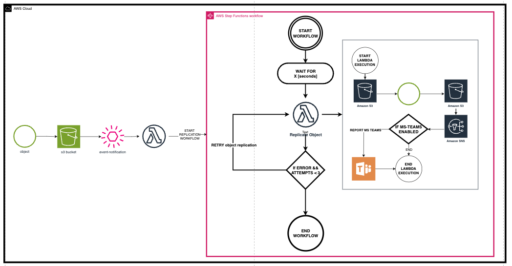

# Terraform Module: Delay S3 Object Replication

This Terraform module configures a custom delay for S3 object replication using AWS Step Functions and Lambda. It supports configurable notifications via SNS and Microsoft Teams.

## Features

- Delay S3 object replication with a custom delay (in seconds).
- Notify via Amazon SNS for success and error events.
- Optional reporting to Microsoft Teams via a webhook.
- Configurable error and success email templates.
- Fully customizable via Terraform variables.

---

## Architecture/Infrastructure

This solution leverages the following AWS services:

- **AWS Step Functions**  
  Orchestrates the custom delay workflow for S3 object replication.

- **AWS Lambda**  
  Executes the delay logic and triggers the replication process.

- **AWS S3**  
  Stores the source and destination objects for replication.

- **AWS SNS**  
  Sends notifications to specified email addresses upon success or failure.

- **Microsoft Teams**  
  Optionally reports workflow execution status via a Teams webhook.

The following is the infrastructure diagram of the solution:



---

## Project Structure

```
.
├── example
│   ├── README.md
│   ├── main.tf
│   ├── terraform.tf
│   ├── terraform.tfstate
│   ├── terraform.tfstate.backup
│   ├── variables.tf
│   └── variables.tfvars
├── infra-documentation
│   └── track.git
├── modules
│   └── terraform-aws-delay-s3-object-replication
│       ├── builds
│       │   └── lambda
│       │       └── delay-s3-object-replication.zip
│       ├── lambda
│       │   └── delay-s3-object-replication
│       │       └── index.py
│       ├── data.tf
│       ├── main.tf
│       ├── variables.tf
│       └── versions.tf
├── LICENSE
└── README.md
```

---

## Usage

```hcl
module "delay_s3_object_replication" {
  source = "github.com/BhekimpiloNdhlela/terraform-aws-delay-s3-object-replication.git"

  environment                = "prod"
  naming_prefix              = "s3-replication-delay"
  region                     = "us-east-1"
  notification_emails        = ["bheki@cloudandthings.io"]
  ms_teams_reporting_enabled = true
  ms_teams_webhook_url       = "https://cloudandthingsza.webhook.office.com/..."
  error_email_subject        = "Lambda Error Notification [S3 Replication Delay]"
  error_email_header         = "Hi 👋🏾,\nThe following error occurred during S3 replication delay:\n"
  error_email_footer         = "Please check the AWS CloudWatch logs for more details.\nBest regards,\nFooBar Team"
  success_email_subject      = "Lambda Success Notification [S3 Replication Delay]"
  success_email_header       = "Hi 👋🏾,\nThe S3 object replication delay completed successfully:\n"
  success_email_footer       = "Please review the AWS CloudWatch logs for detailed execution information.\nBest regards,\nFooBar Team"
  replication_delay_seconds  = 300
  source_bucket              = "source-bucket"
  destination_bucket         = "destination-bucket"
}
```

---

## Inputs

| Name                         | Type           | Description                                                   |
| ---------------------------- | -------------- | ------------------------------------------------------------- |
| `environment`                | `string`       | The environment for deployment (e.g., `dev`, `test`, `prod`). |
| `naming_prefix`              | `string`       | Prefix for naming AWS resources.                              |
| `region`                     | `string`       | AWS region for resource deployment.                           |
| `notification_emails`        | `list(string)` | List of email addresses to receive notifications.             |
| `ms_teams_reporting_enabled` | `bool`         | Enable or disable MS Teams reporting.                         |
| `ms_teams_webhook_url`       | `string`       | Microsoft Teams webhook URL for reporting.                    |
| `error_email_subject`        | `string`       | Subject for error notification emails.                        |
| `error_email_header`         | `string`       | Header for error notification emails.                         |
| `error_email_footer`         | `string`       | Footer for error notification emails.                         |
| `success_email_subject`      | `string`       | Subject for success notification emails.                      |
| `success_email_header`       | `string`       | Header for success notification emails.                       |
| `success_email_footer`       | `string`       | Footer for success notification emails.                       |
| `replication_delay_seconds`  | `number`       | The delay (in seconds) before triggering S3 replication.      |
| `source_bucket`              | `string`       | The source S3 bucket for object replication.                  |
| `destination_bucket`         | `string`       | The destination S3 bucket for object replication.             |

---

## Outputs

| Name                    | Description                                  |
| ----------------------- | -------------------------------------------- |
| `step_function_arn`     | ARN of the Step Function workflow.           |
| `lambda_function_name`  | Name of the Lambda function.                 |
| `sns_topic_arn`         | ARN of the SNS topic for notifications.      |

---

## Requirements

- Terraform 1.0+
- AWS Provider 4.0+
- IAM permissions to manage S3, Lambda, Step Functions, and SNS.

---

## Deployment

1. Clone the repository:

   ```bash
   git clone https://github.com/BhekimpiloNdhlela/terraform-aws-delay-s3-object-replication.git
   cd terraform-aws-delay-s3-object-replication
   ```

2. Create a `terraform.tfvars` file with your configuration:

   ```hcl
   environment                = "prod"
   naming_prefix              = "s3-replication-delay"
   region                     = "us-east-1"
   notification_emails        = ["bheki@cloudandthings.io"]
   ms_teams_reporting_enabled = true
   ms_teams_webhook_url       = "https://cloudandthingsza.webhook.office.com/..."
   replication_delay_seconds  = 300
   source_bucket              = "source-bucket"
   destination_bucket         = "destination-bucket"
   ```

3. Initialize Terraform:

   ```bash
   terraform init
   ```

4. Plan and apply:
   ```bash
   terraform plan
   terraform apply
   ```

---

## Author

This module is maintained by **Bheki Ndhlela**. Contributions are welcome!

## License

This project is licensed under the MIT License. See the [LICENSE](LICENSE) file for details.

